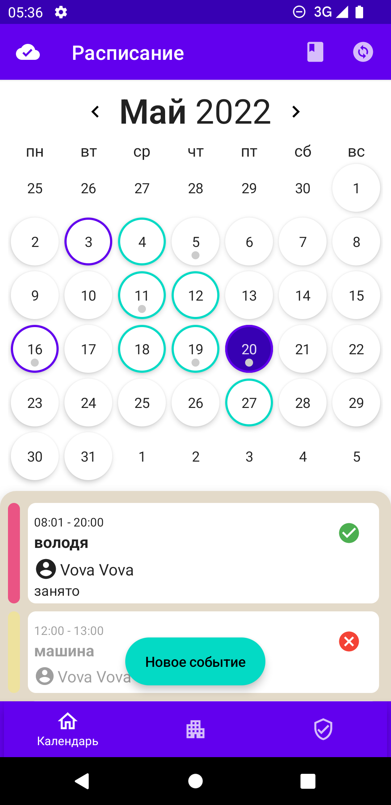
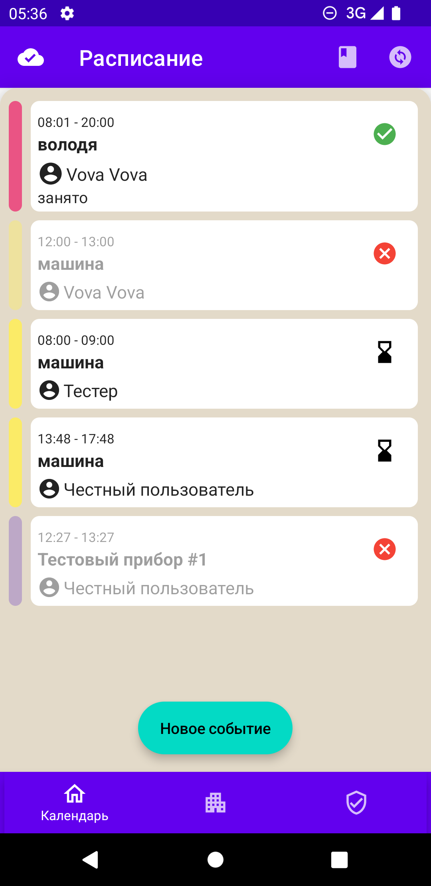
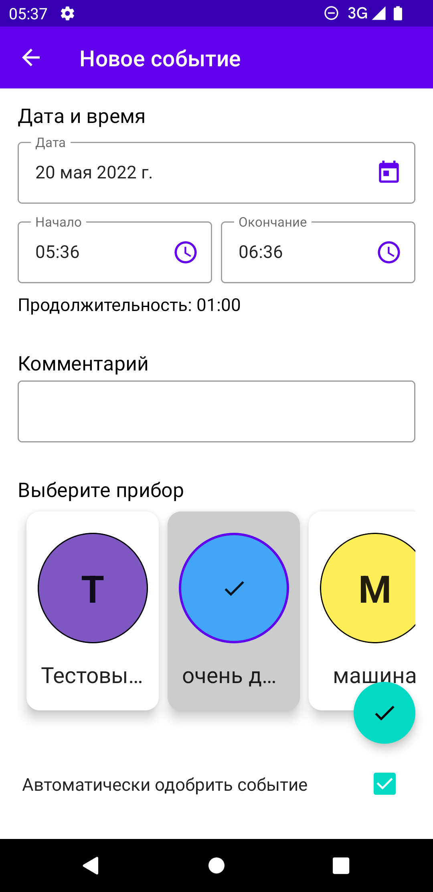
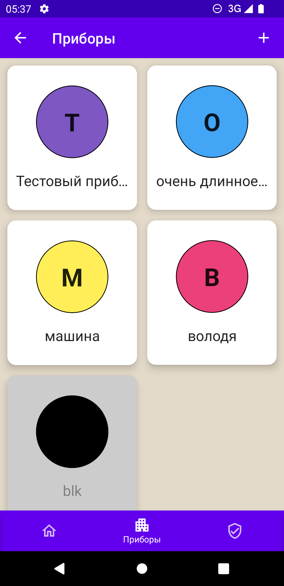

# Schedule

The application is designed to maintain a schedule of devices at the Far Eastern Federal University.

You can:
- Create bookings
- Leave a comment on the booking
- Cancel booking
- View existing fixtures and their superusers
- Confirm or reject bookings (if you are a device superuser)
- Receive notifications of new bookings as well as changes to existing ones

## Screenshots
 
 
